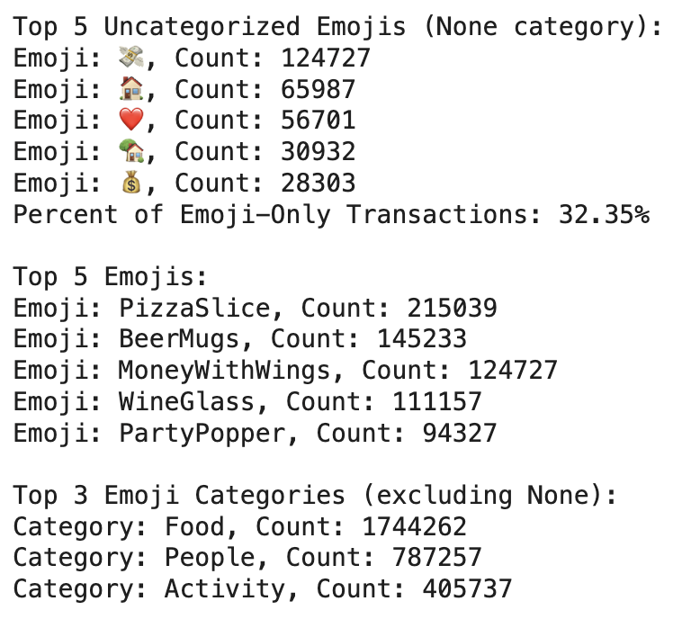
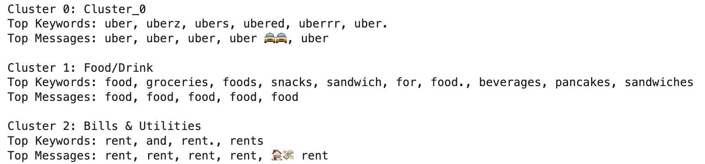
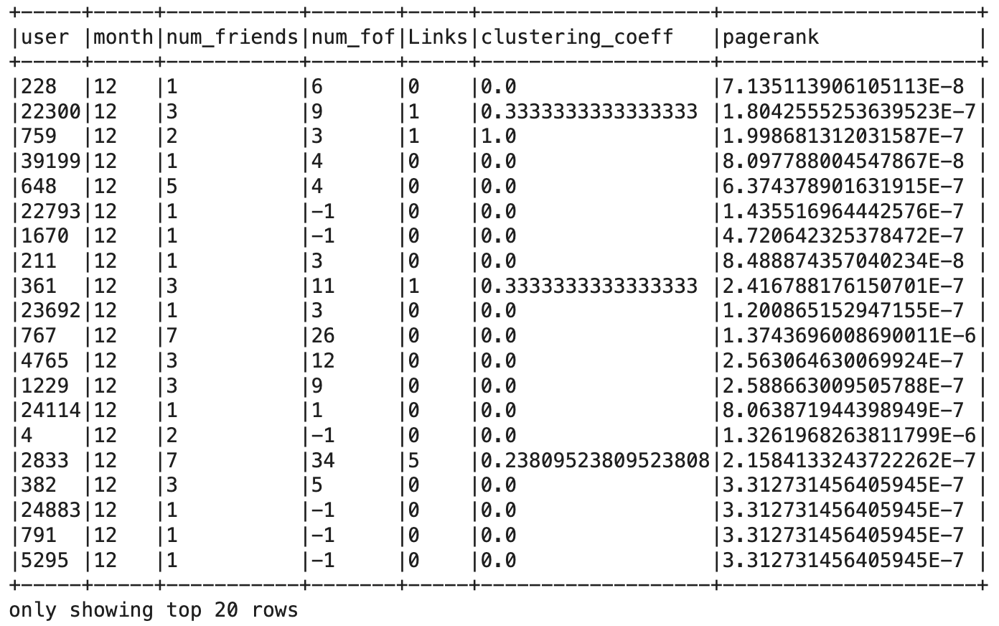

# Predicting User Transaction Amounts Based on Behavioral Features (Simulated Venmo Sample Data)

## Overview
This project explores Venmo transaction data to understand user behavior and social structure, culminating in a **predictive model** of transaction volume. By combining **natural language processing**, **social network analysis**, and **MLlib models**, we simulate how platforms like Venmo can leverage early user data to **forecast total transaction activity** — enabling smarter user segmentation and marketing strategies.

---

## Business Problem
> _How early can we predict a Venmo user's total transaction volume using their social connections and behavioral signals?_
 
Retail and financial tech platforms thrive on understanding customer lifetime value (CLV). Our goal is to predict a user's transaction activity in their first year based on early data, allowing for proactive targeting of high-value users.

---

## Dataset Summary
- ~1.8M transaction messages (sender, receiver, text, timestamp)
- Word and emoji dictionaries for semantic classification
- Social network: users connected via transaction pairs
- Derived user features (recency, frequency, spending profiles)
- Timeline: user behavior tracked for first 12 months

---

## Technologies & Tools
- **Apache Spark / PySpark**
- **MLlib** (regression models)
- **HDBSCAN + DistilBERT** (for topic discovery)
- **NetworkX** (for PageRank)
- **UMAP / Matplotlib** (for cluster visualization)
- **Google Colab**

---

## Methodology

### 1. **Text Classification**
- Used word and emoji dictionaries to categorize Venmo transaction messages
- Classified 32% of messages as emoji-only (e.g., 🍕💸🎉)
- Built user profiles by aggregating category proportions across messages

### 2. **Spending Profile Analysis**
- Built static and dynamic profiles to track category usage over time
- Applied Spark window functions to calculate monthly cumulative category shares
- Found user behavior stabilizes around month 6–8

### 3. **Topic Discovery with DistilBERT**
- Processed ~37K clean messages using DistilBERT embeddings
- Clustered messages using HDBSCAN
- Found 3 major semantic groups: Food/Drink, Transportation, Bills & Utilities

### 4. **Social Network Analysis**
- Constructed undirected graph from transaction pairs
- Computed:
  - Friends and friends-of-friends
  - Clustering coefficients
  - PageRank (via NetworkX)

### 5. **Predictive Modeling (MLlib)**
- Target: total number of transactions in a user’s first 12 months
- Features:
  - Recency (days since last transaction)
  - Frequency (30 / tx count per month)
  - Social metrics (friends, friends-of-friends, PageRank)
- Models:
  - Model A: Recency + Frequency (baseline)
  - Model B: Model A + Behavioral Profile
  - Model C: Model B + Social Features (best performance)

---

## Results

- **Model C (RF + Social)** consistently achieved lowest MSE across months
- **Social variables** provided most predictive power **early in a user’s lifecycle**
- Dynamic profile plots show that transaction categories stabilize over time
- **Clustering coefficient** and **PageRank** metrics offer strong segmentation signals

---

## Key Insights

- **The model that included both user behavior and social connections gave the most accurate predictions** of future transactions. This shows that who you interact with is just as important as what you do.
- **Social connections were especially useful early on**, helping predict user activity even when there wasn’t much behavior data yet.
- Our language model (DistilBERT) grouped similar transaction messages well, but didn’t always match our predefined categories — combining both methods might work better.
- Many Venmo users rely on **emojis instead of text** to describe transactions, highlighting how the app blends social interaction with financial activity.

---
## Business Recommendations

### 1. **Use Social Connections for Early High-Value User Detection**
- Users with strong network connections (e.g., many friends, high PageRank) are likely to be more active — even before showing consistent transaction behavior.
- **Action:** Prioritize these users for early engagement, onboarding flows, and retention offers.

### 2. **Stick to Social-Driven Incentive Programs**
- Group-based and referral rewards are widely used across the industry for a reason — they work. Your analysis confirms that social ties strongly influence future engagement.
- **Action:** Continue investing in referral bonuses, peer rewards, and group activity campaigns to drive growth and retention.

### 3. **Build Hybrid Models for Message Understanding**
- Transaction messages are often informal and emoji-heavy. Embedding models like DistilBERT capture deeper meaning, while rule-based logic ensures precision.
- **Action:** Combine semantic embeddings with dictionary rules for better user profiling, trend detection, and fraud monitoring.

### 4. **Personalize Experiences Based on Spending Patterns**
- Users tend to develop stable spending preferences (e.g., food, utilities) over time.
- **Action:** Deliver personalized summaries and targeted offers (e.g., dining cashback for food-heavy users) to improve satisfaction and loyalty.

---

## Future Improvements

- Retry topic discovery using LLaMA 3-8B embeddings
- Improve emoji dictionary coverage (e.g., ❤️💸🎈 not categorized)
- Build real-time scoring API using Spark streaming + Flask
- Deploy models to rank incoming users based on predicted transaction value

---

