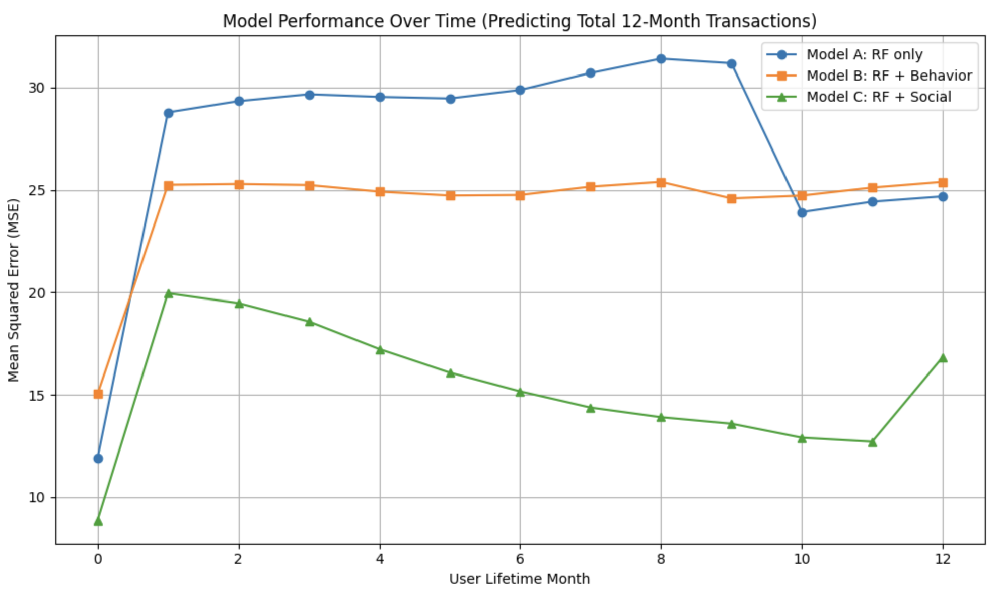

# Predicting User Transaction Amounts Based on Behavioral Features (Simulated Venmo Sample Data)

## Overview
This project explores Venmo transaction data to understand user behavior and social structure, culminating in a **predictive model** of transaction volume. By combining **natural language processing**, **social network analysis**, and **MLlib models**, we simulate how platforms like Venmo can leverage early user data to **forecast total transaction activity** — enabling smarter user segmentation and marketing strategies.

---

## Business Problem
> _How early can we predict a Venmo user's total transaction volume using their social connections and behavioral signals?_
 
Retail and financial tech platforms thrive on understanding customer lifetime value (CLV). Our goal is to predict a user's transaction activity in their first year based on early data, allowing for proactive targeting of high-value users.

---

## Dataset Summary
- ~1.8M transaction messages (sender, receiver, text, timestamp)
- Word and emoji dictionaries for semantic classification
- Social network: users connected via transaction pairs
- Derived user features (recency, frequency, spending profiles)
- Timeline: user behavior tracked for first 12 months

---

## Technologies & Tools
- **Apache Spark / PySpark**
- **MLlib** (regression models)
- **HDBSCAN + DistilBERT** (for topic discovery)
- **NetworkX** (for PageRank)
- **UMAP / Matplotlib** (for cluster visualization)
- **Google Colab**

---

## Methodology

### 1. **Text Classification**
- Used word and emoji dictionaries to categorize Venmo transaction messages
- Classified 32% of messages as emoji-only (e.g., 🍕💸🎉)
#### Emoji Usage Summary

##### Top 5 Uncategorized Emojis (None category)

| Emoji | Description         | Count   |
|-------|---------------------|---------|
| 💸    | Money With Wings    | 124,727 |
| 🏠    | House               | 65,987  |
| ❤️    | Red Heart           | 56,701  |
| 🏡    | House with Garden   | 30,932  |
| 💰    | Money Bag           | 28,303  |

**Percent of Emoji-Only Transactions**: `32.35%`

---

##### Top 5 Emojis Overall

| Emoji Name      | Count    |
|-----------------|----------|
| PizzaSlice      | 215,039  |
| BeerMugs        | 145,233  |
| MoneyWithWings  | 124,727  |
| WineGlass       | 111,157  |
| PartyPopper     | 94,327   |

---

##### Top 3 Emoji Categories (excluding None)

| Category | Count     |
|----------|-----------|
| Food     | 1,744,262 |
| People   | 787,257   |
| Activity | 405,737   |

### 2. **Spending Profile Analysis**
- Built static and dynamic profiles to track category usage over time
- Applied Spark window functions to calculate monthly cumulative category shares
- Found user behavior stabilizes around month 6–8
#### Sample of User Spending Profiles (Top 10 Rows)

| user1 | Category         | Percentage |
|-------|------------------|------------|
| 3     | Food             | 33.33%     |
| 3     | People           | 33.33%     |
| 3     | Utility          | 33.33%     |
| 4     | Activity         | 33.33%     |
| 4     | Food             | 33.33%     |
| 4     | Illegal/Sarcasm  | 16.67%     |
| 4     | Travel           | 16.67%     |
| 10    | Activity         | 10.00%     |
| 10    | Food             | 60.00%     |
| 10    | People           | 20.00%     |

### 3. **Topic Discovery with DistilBERT**
- Processed ~37K clean messages using DistilBERT embeddings
- Clustered messages using HDBSCAN
- Found 3 major semantic groups: Food/Drink, Transportation, Bills & Utilities
#### Topic Clusters Discovered with DistilBERT + HDBSCAN

##### Cluster 0: Transportation
- **Top Keywords:** uber, uberz, ubers, ubered, uberrr, uber
- **Top Messages:** uber, uber, uber, 🚖🚗, uber

##### Cluster 1: Food/Drink
- **Top Keywords:** food, groceries, foods, snacks, sandwich, for, food., beverages, pancakes, sandwiches
- **Top Messages:** food, food, food, food

##### Cluster 2: Bills & Utilities
- **Top Keywords:** rent, and, rent., rents
- **Top Messages:** rent, rent, rent, 🏡💸 rent

### 4. **Social Network Analysis**
- Constructed undirected graph from transaction pairs
- Computed:
  - Friends and friends-of-friends
  - Clustering coefficients(how tightly connected a user’s friends are to each other?/If I’m connected to 5 friends, how many of them are also friends with each other?)
  - PageRank (User's influence in the network)(via NetworkX)
#### Sample of User Social Network Metrics (Top 20 Rows)

| user  | month | num_friends | num_fof | Links | clustering_coeff     | pagerank           |
|-------|--------|--------------|---------|--------|------------------------|---------------------|
| 228   | 12     | 1            | 6       | 0      | 0.0                    | 7.13513906105113E-8 |
| 22300 | 12     | 3            | 9       | 1      | 0.3333333333333333     | 1.8042555253639523E-7 |
| 759   | 12     | 2            | 3       | 1      | 1.0                    | 1.998681312031587E-7 |
| 39199 | 12     | 1            | 4       | 0      | 0.0                    | 8.097788004547867E-8 |
| 648   | 12     | 5            | 4       | 0      | 0.0                    | 6.374378901631915E-7 |
| 22793 | 12     | 1            | -1      | 0      | 0.0                    | 1.435516964442576E-7 |
| 1670  | 12     | 1            | -1      | 0      | 0.0                    | 4.720642325378472E-7 |
| 211   | 12     | 1            | 3       | 0      | 0.0                    | 8.488874357040234E-8 |
| 361   | 12     | 3            | 11      | 1      | 0.3333333333333333     | 2.416788176150701E-7 |
| 23692 | 12     | 1            | 3       | 0      | 0.0                    | 1.200865152947155E-7 |
| 767   | 12     | 7            | 26      | 0      | 0.0                    | 1.3743696008690011E-6 |
| 4765  | 12     | 3            | 12      | 0      | 0.0                    | 2.563064630069924E-7 |
| 1229  | 12     | 3            | 9       | 0      | 0.0                    | 2.588663009505788E-7 |
| 24114 | 12     | 1            | 1       | 0      | 0.0                    | 8.063871944398949E-7 |
| 4     | 12     | 2            | -1      | 0      | 0.0                    | 1.3261968263811799E-6 |
| 2833  | 12     | 7            | 34      | 5      | 0.23809523809523808    | 2.1584133243722262E-7 |
| 382   | 12     | 3            | 5       | 0      | 0.0                    | 3.312731456405945E-7 |
| 24883 | 12     | 1            | -1      | 0      | 0.0                    | 3.312731456405945E-7 |
| 791   | 12     | 1            | -1      | 0      | 0.0                    | 3.312731456405945E-7 |
| 5295  | 12     | 1            | -1      | 0      | 0.0                    | 3.312731456405945E-7 |

### 5. **Predictive Modeling (MLlib)**
- Target: total number of transactions in a user’s first 12 months
- Features:
  - Recency (days since last transaction)
  - Frequency (30 / tx count per month)
  #### Sample of Recency-Frequency Data with Target Variable `Y`

| user | month | recency | frequency | Y |
|------|--------|---------|-----------|---|
| 28   | 0      | 8       | 15.0      | 2 |
| 31   | 0      | 11      | 30.0      | 1 |
| 34   | 1      | 15      | 30.0      | 5 |
| 34   | 0      | 9       | 30.0      | 5 |
| 34   | 3      | 6       | 30.0      | 5 |
| 34   | 2      | 5       | 30.0      | 5 |
| 34   | 4      | 16      | 30.0      | 5 |
| 108  | 0      | 4       | 30.0      | 1 |
| 126  | 11     | 22      | 30.0      | 2 |
| 126  | 0      | 4       | 30.0      | 2 |

  - User profile (percentage of transactions each topic)
  - Social metrics (friends, friends-of-friends, PageRank)
  

 
- Models:
  - Model A: Recency + Frequency (baseline)
  - Model B: Model A + Behavioral Profile
  - Model C: Model B + Social Features (best performance)

---

## Results

- **Model C (RF + Social)** consistently achieved lowest MSE across months
- **Social variables** provided most predictive power **early in a user’s lifecycle**
- Dynamic profile plots show that transaction categories stabilize over time
- **Clustering coefficient** and **PageRank** metrics offer strong segmentation signals

---

## Key Insights

- **The model that included both user behavior and social connections gave the most accurate predictions** of future transactions. This shows that who you interact with is just as important as what you do.
- **Social connections were especially useful early on**, helping predict user activity even when there wasn’t much behavior data yet.
- Our language model (DistilBERT) grouped similar transaction messages well, but didn’t always match our predefined categories — combining both methods might work better.
- Many Venmo users rely on **emojis instead of text** to describe transactions, highlighting how the app blends social interaction with financial activity.

---
## Business Recommendations

### 1. **Use Social Connections for Early High-Value User Detection**
- Users with strong network connections (e.g., many friends, high PageRank) are likely to be more active — even before showing consistent transaction behavior.
- **Action:** Prioritize these users for early engagement, onboarding flows, and retention offers.

### 2. **Stick to Social-Driven Incentive Programs**
- Group-based and referral rewards are widely used across the industry for a reason — they work. Your analysis confirms that social ties strongly influence future engagement.
- **Action:** Continue investing in referral bonuses, peer rewards, and group activity campaigns to drive growth and retention.

### 3. **Build Hybrid Models for Message Understanding**
- Transaction messages are often informal and emoji-heavy. Embedding models like DistilBERT capture deeper meaning, while rule-based logic ensures precision.
- **Action:** Combine semantic embeddings with dictionary rules for better user profiling, trend detection, and fraud monitoring.

### 4. **Personalize Experiences Based on Spending Patterns**
- Users tend to develop stable spending preferences (e.g., food, utilities) over time.
- **Action:** Deliver personalized summaries and targeted offers (e.g., dining cashback for food-heavy users) to improve satisfaction and loyalty.

---

## Future Improvements

- Retry topic discovery using LLaMA 3-8B embeddings
- Improve emoji dictionary coverage (e.g., ❤️💸🎈 not categorized)
- Build real-time scoring API using Spark streaming + Flask
- Deploy models to rank incoming users based on predicted transaction value

---

